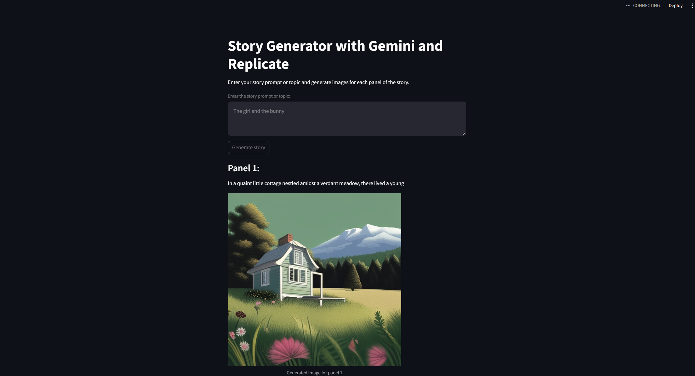
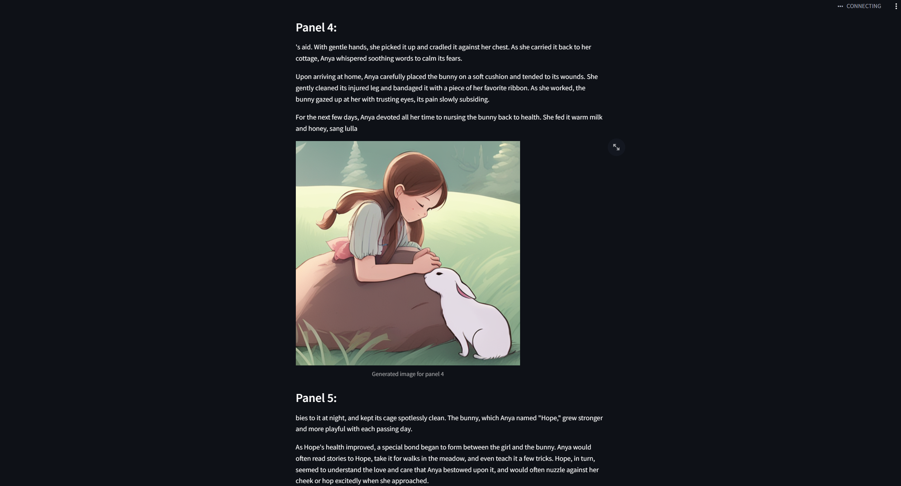

# StoryFrame

### Story Generator with Gemini and Replicate

This Python streamlit application which generates a story based on user prompts using the Gemini API for text generation and the Replicate API for image generation. Users can input a story prompt or topic, and the application generates images for each panel of the story.

## Screenshots:





## Prerequisites

Before running the application, ensure you have the following:

- Python 3.x installed on your system.
- An account with Gemini to obtain the API key.
- An account with Replicate to obtain the API token.
- Environment variables set up in a `.env` file containing `GEMINI_API_KEY` and `REPLICATE_API_TOKEN`.

## Installation

1. Clone the repository:

   ```bash
   git clone https://github.com/mehek1020/story-generator.git
   ```

2. Navigate to the project directory:

   ```bash
   cd story-generator
   ```

3. Install the required dependencies:

   ```bash
   pip install -r requirements.txt
   ```

## Usage

1. Run the Streamlit app:

   ```bash
   streamlit run app_name.py
   ```

2. Enter your story prompt or topic in the provided text area.

3. Click on the "Generate story" button.

4. Wait for the story panels and generated images to appear.

## Features

- Uses Gemini API for text generation.
- Utilizes Replicate API for image generation.
- Provides a user-friendly interface with Streamlit.

## Contributions

Contributions are welcome! If you find any issues or have suggestions for improvements, feel free to open an issue or create a pull request.

## License

This project is licensed under the MIT License. See the LICENSE file for details.
